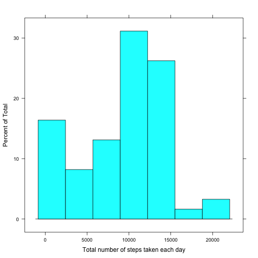
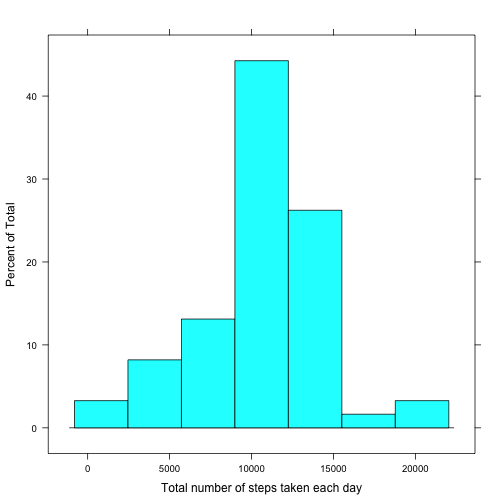
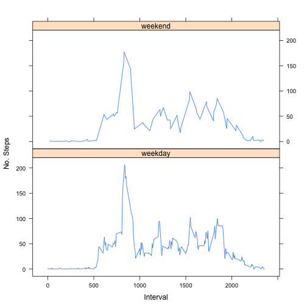

# Reproducible Research: Peer Assessment 1


## Loading and preprocessing the data
We start by including any necessary R libraries for the data processing

```r
  library(lattice)
```

We then load the data using read.csv(), as the data is in a reasonable format no data transformation or processing is required.


```r
  data <- read.csv("activity.csv")
```


## What is mean total number of steps taken per day?

To make a histogram of the total number of steps taken each day we use the histogram() function from the lattice package.

We first sum the number of steps taken over each date using the aggregate() function.


```r
  stepsByDate <- aggregate(data$steps, by=list(Category=data$date), FUN=sum, na.rm=TRUE)
  histogram(stepsByDate$x, xlab="Total number of steps taken each day")
```

 

We then use this data to calculate the mean and median values

```r
  mean(stepsByDate$x, na.rm = TRUE)
```

```
## [1] 9354
```

```r
  median(stepsByDate$x, na.rm = TRUE)
```

```
## [1] 10395
```

## What is the average daily activity pattern?

We first calculate the mean of the number of steps taken over each unique interval using the aggregate() function. We can then plot this against the Date.


```r
aveStepsByInterval <- aggregate(data$steps, by=list(data$interval), FUN=mean, na.rm=TRUE)
plot(unique(data$interval), aveStepsByInterval$x ,type="l", xlab="Interval", ylab="Average number of steps")
```

 

The interval in which the maximum number of steps taken value is calculated as follows, using our previous data


```r
aveStepsByInterval[aveStepsByInterval$x==max(aveStepsByInterval$x), 1]
```

```
## [1] 835
```

## Inputing missing values

To sum the number of missing values in the dataset we use the complete.cases function 

```r
sum(!complete.cases(data))
```

```
## [1] 2304
```

To fill in the missing data, we will use the mean number of steps for that specific interval. To achieve this we will use the plyr package

```r
library(plyr)
impute.mean <- function(x) replace(x, is.na(x), mean(x, na.rm = TRUE))
data2 <- ddply(data, ~interval, transform, steps = impute.mean(steps))
```

Redo the previous calculations for mean total number of steps taken per day.

First we create a histogram

```r
  stepsByDate2 <- aggregate(data2$steps, by=list(Category=data2$date), FUN=sum, na.rm=TRUE)
  histogram(stepsByDate2$x,  xlab="Total number of steps taken each day")
```

 

We then calculate the mean and median values

```r
  mean(stepsByDate2$x, na.rm = TRUE)
```

```
## [1] 10766
```

```r
  median(stepsByDate2$x, na.rm = TRUE)
```

```
## [1] 10766
```

## Are there differences in activity patterns between weekdays and weekends?

Create a new factor variable, indicating whether a date is a weekday or weekend
We start by converting the date column to date format.
Next we use the weekdays function to extract the day of the week for that date and compare to a vector of weekend day names.


```r
data2$date <- as.Date(data2$date , format = "%Y-%m-%d")
data2$weekend = factor(ifelse(weekdays(data2$date) %in% c("Saturday", "Sunday"), "weekend", "weekday"))
```

We can then plot this data using the lattice 

```r
  aveStepsByInterval <- aggregate(data2$steps, by=list(data2$interval), FUN=mean, na.rm=TRUE)$x

  xyplot(aveStepsByInterval~unique(interval) | weekend, data=data2, type="l", layout = c(1, 2), xlab="Interval", ylab="No. Steps")
```

 
